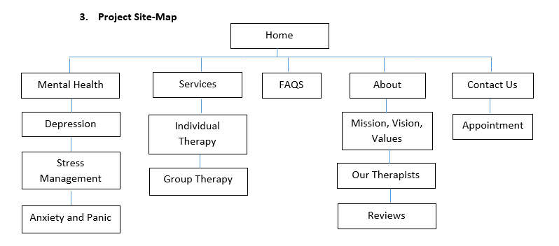

code {
  white-space : pre-wrap !important;
}


# HealthMinded Therapy Website By Group 2

## A web project for Web Technologies INFO 2302 Section 2, KICT IIUM SEM 1 2020/2021


### Healthminded Therapy

##### Healthminded Therapy is a website for a local Counseling and mental therapy service provider based in Gombak

Prepared by Syed Azamuddin \(1928931\)

#### 1.**Project Description**
    ```
    Mental health is a big issue for 21st century’s society. As the world progresses at unprecedented pace, the mental illnesses among members of society have skyrocketed as well due to the nature of the modern lifestyle. For the final project of INFO 2302 , we have decided to make a website for counseling and mental therapist service. We believe that this project could serve as a training for us so that we could someday help the ummah to solve the problems related to mental health as a web developer. To realise this aspiration , we have set a few goals as guidelines.
    
    Our main goal for this project is to design a website capable of relaying client’s requests on the net without physical contact. As the covid-19 swept the world by surprise, many clients, especially those who live under quarantine, have faced the difficulty to contact their therapist for an appointment. For an effective workaround, we will use and design an online form, and embed it in our website. Secondly, to provide ample information to the client, we will provide some information on mental health as well as access to the details of our service, the operation time, and all necessary information of our operation activity. This will help them to make decisions better especially for those who need to schedule an appointment with us. Lastly, we need to emphasize the expertise of our counselors to the future client and create familiarity with them. By doing this, they will feel more confident with our service and their doubts will be removed. Hence, we will create a webpage which will display the information of our personnel and the client could click it right away from the main homepage.
    
    We have collected our ideas together so that we can design our project in the best way possible in order to achieve the goals mentioned earlier. The theme of our webpage is minimalism. We want to present our webpage in the most humble way possible so that the clients when visiting our webpage, they won’t feel intimidated and hopefully just by the design, we can earn the clients’ trust and give them hope. Therefore we make sure the color of the webpage gives off calm feelings and the webpage is easy to navigate through. To create great user experience, we will use basic but various web tech tools. We will also present in the homepage, only what is necessary. There will be helpful and important information on the more common mental illnesses which are depression and anxiety as well as how to cope with stress. Lastly, once the client understands the information and decides that they want to receive help, they can reach out to the ‘contact us’ section and fill out the form to make an appointment with a counselor or a mental therapist.
    ```
#### 2.**Project Sitemap**

    

#### 3.**Group Contribution**

    Each of the team members prepared 1 web pages for the project as shown in the following table.

     Name  | Contribution

#### 4.**Use of third party resources**

| web elements | Name    | Use of third party resources and modification | Modification |
| ------------ | ------- | --------------------------------------------- | ------------ |
| test1        | test2   | test 3                                        | test4        |
| ------       | ------- | --------                                      | ------       |
| test1        | test2   | test 3                                        | test4        |
| ------       | ------- | --------                                      | ------       |
| test1        | test2   | test 3                                        | test4        |
| ------       | ------- | --------                                      | ------       |
| test1        | test2   | test 3                                        | test4        |
| ------       | ------- | --------                                      | ------       |

#### 5.**References**
